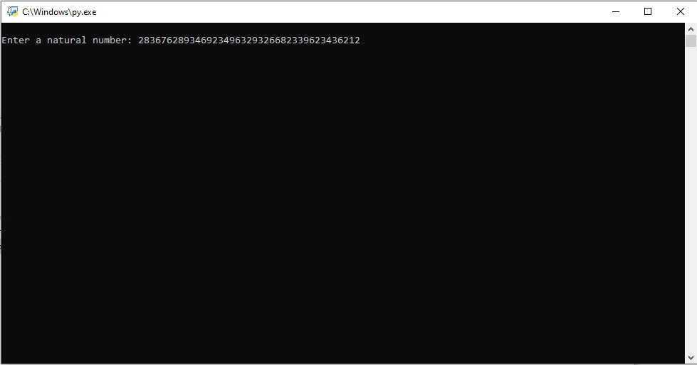
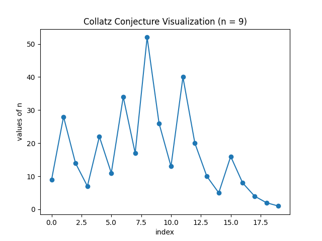
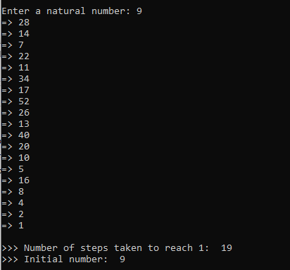

# Collatz Conjecture Visualizer

Enter a natural number and watch how its transform to 1 through the Collatz process.

This program lets you visually and texually view how a given natural number transforms to 1 through the Collatz process. Each step is shown.

## Large Numbers
Version 1.0 can support natural number inputs with a maximum of 4300 digits. Problems could occur with graphing numbers these large, based on device.
