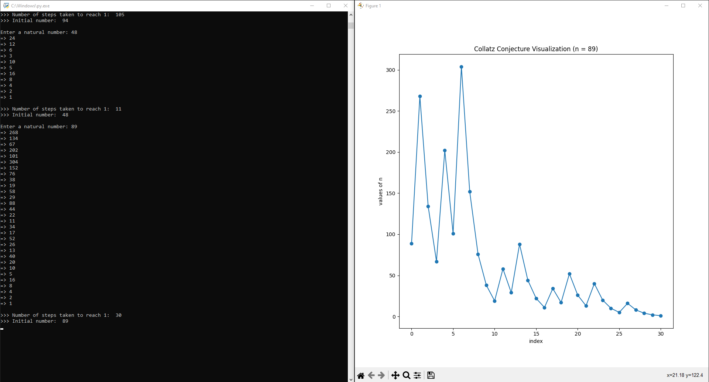

# Collatz Conjecture Visualizer

This program exhibits the unique and interesting behavior of the [Collatz Conjecture](https://en.wikipedia.org/wiki/Collatz_conjecture).

 
 
 
Enter a natural number and watch how it transforms to 1 through the Collatz process.

 
 
 
This program lets you visually and texually view how a given natural number transforms to 1 through the Collatz process. Each step is shown.

## Large Numbers
Version 1.0 can support natural number inputs with a maximum of 4300 digits. Problems could occur with graphing numbers these large, based on device.
